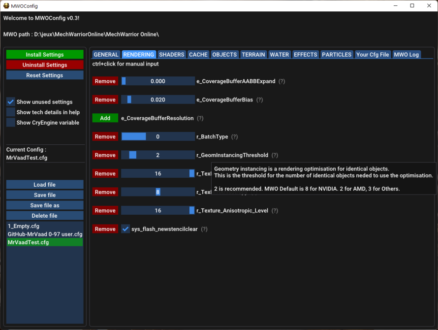

# MWOConfig
CryEngine 3 Cfg Editor and Log Viewer for Mechwarrior Online

## Install
Jut unzip MWOConfig's zip file.
You can install MWOConfig anywhere (except in MWO's directory) 
If you use MWO with Steam, you need to put your MWO install path in MWOConfig.ini.

## Usage
Just launch MWOConfig.exe
When starting, MWOConfig will load the config installed in your game (if present)

The Install button will copy two files in your MWO directory (user.cfg and tuning.cfg, files that have been allowed by MWO's rules for years)
The Uninstall button will remove those two files.

## Configs
You can copy your existing configs in the saved
 directory of MWOConfig

## CryEngine supported settings
Currently, MWOConfig will only write the supported variables. 

When loading a config, the unsupported variables will show in red in the "your cfg file" tab.
This tab shows what will happen if you click "save" or "install",
 the variables in red will be removed (variables not supported) 
